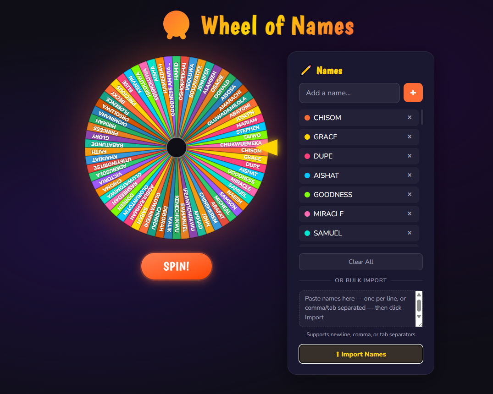

# 🎡 Wheel of Names

A fun, beautifully designed spin wheel for randomly picking names — perfect for giveaways, classroom activities, team decisions, and more.



---

## ✨ Features

- **Spin animation** — smooth eased deceleration with randomized speed and rotations
- **Winner modal** — celebratory popup with confetti when the wheel stops
- **Remove winner** — optional checkbox to automatically drop the winner from the wheel after each spin
- **Add names one by one** — type a name and press Enter or click `+`
- **Bulk paste import** — paste a list of names (newline, comma, or tab separated) and import them all at once
- **Duplicate detection** — skips names already on the wheel during bulk import
- **Delete individual names** — click `×` next to any name to remove it
- **Clear all** — wipe the wheel clean in one click
- **Color-coded slices** — each name gets a unique color that matches its wheel slice and list entry
- **Responsive design** — works on desktop and mobile

---

## 🚀 Getting Started

No installation or build step required. Just open the file in your browser.

```bash
# Clone or download the repo, then open the file
open index.html
```

Or simply double-click `index.html` in your file explorer.

---

## 🎮 How to Use

### Adding Names
- Type a name into the input field and press **Enter** or click **+**
- To add many names at once, paste a list into the **bulk import textarea** and click **⬆ Import Names**
- Supported formats: one name per line, comma-separated, or tab-separated

### Spinning
- Click the **SPIN!** button to spin the wheel
- The wheel spins with a satisfying deceleration and lands on a random name
- A winner popup appears with confetti 🎉

### Managing Names
- Click **×** next to any name to remove it from the wheel
- Check **"Remove winner from wheel"** in the winner popup to eliminate winners automatically
- Click **Clear All** to reset the wheel completely

---

## 🛠️ Built With

- Vanilla HTML, CSS, and JavaScript — zero dependencies
- Canvas API for wheel rendering
- Google Fonts — [Boogaloo](https://fonts.google.com/specimen/Boogaloo) + [Nunito](https://fonts.google.com/specimen/Nunito)

---

## 📄 License

MIT — free to use, modify, and share.
